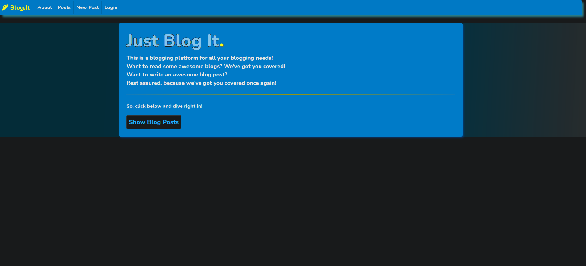
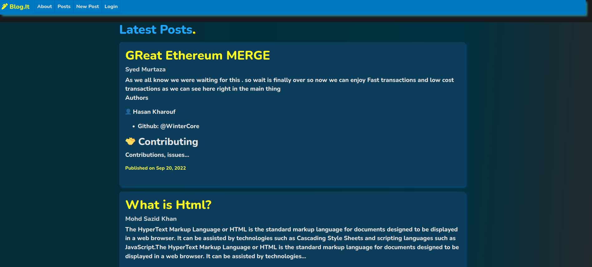
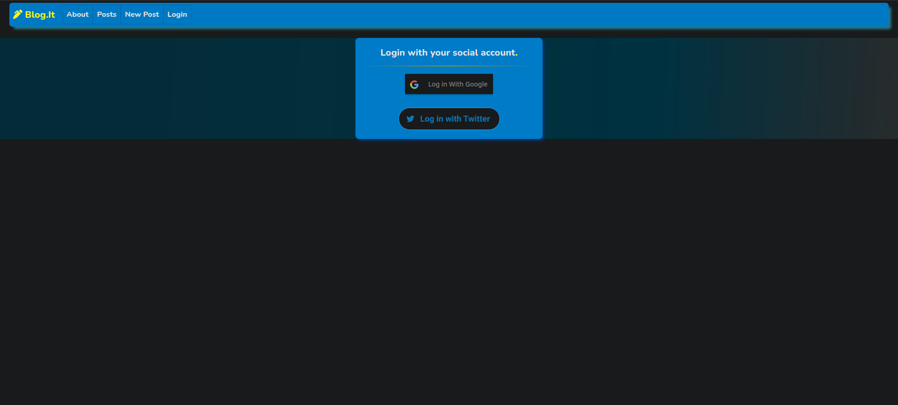

# Blog APP

  

A MERN stack blogging PWA(Progressive Web App), with user authentication and social login using Twitter 🐦 and Google accounts.

## Getting Started

-   Fork this repo and run the `git clone <forked repo>` command from your terminal/bash
-   Cd into the directories and `npm install`
-   Create a `.env` file in the root directory and store the following:
    -   MONGO_URI=Insert the correct connection URL for your MongoDB database
    -   REACT_APP_GOOGLE_CLIENT_ID=Insert the valid google client id
    -   REACT_APP_TWIITER_CONSUMER_ID=Insert the valid twitter consumer id
    -   REACT_APP_TWITTER_CONSUMER_SECRET=Insert the valid twitter consumer id
-   Run the server on PORT 5000
-   npm start/yarn start

You can obtain the MONGO_URI after create a collectoin on [mongodb atlas](https://www.mongodb.com/cloud/atlas). For the GOOGLE_CLIENT_ID and the TWITTER_CONSUMER_SECRET/ID, you will need to go through the Google developer console and the Twitter developer accounts page respectively

## Technologies Jargon

Some of the technologies used in the development of this web application are as follow:

-   [MongoDB Atlas](https://www.mongodb.com/cloud/atlas): It provides a free cloud service to store MongoDB collections.
-   [React.js](https://reactjs.org/): A JavaScript library for building user interfaces.
-   [Node.js](https://nodejs.org/en/): A runtime environment to help build fast server applications using JS.
-   [Express.js](https://expressjs.com/): A popular Node.js framework to build scalable server-side for web applications.
-   [Mongoose](https://mongoosejs.com/): An ODM(Object Data Modelling)library for MongoDB and Node.js
-   [Heroku](http://heroku.com/): A platform(PaaS) to deploy full stack web applications for free.
-   [JSON Web Tokens or JWTs](https://jwt.io/): A standard to securely authenticate HTTP requests
-   [Bootstrap 4](https://getbootstrap.com/docs/4.0/getting-started/introduction/): A popular framework for building responsive, mobile-first sites.

##  DEMO
-Main Blog page

-Landing page

-Login Page

 

## Info

-   This is a blogging PWA with user authentication and authorization. There is also a social login option, to login using your Twitter or Google accounts. The blog posts are displayed in the reverse chronological order by default.
-   There is no exploitation of data, as the app only requires access to your accounts to fetch your unique ID for authentication/authorization purposes, and no personal details(except your registred user name on the social account) is used by the application.
-   The frontend of the app is built using React and I have used Bootstrap classes for styling the compnents in addition to my local CSS styles.
-   It is a blog app that lets users read the existing blog posts without logging in, and lets them share their thoughts using the anonymous comment section.
-   Each comment has a unique jdenticon icon to represent the user who commented anonymously
-   There is also a profanity filter to disallow usage of certain NSFW words in the comments' section. This is not an attempt to hinder freedom of speech, but instead it is a necessary aid to prevent misuse of the platform by nefarious users.
-   In order to write a new blog post, the user has to login using one of the social media login options provided. The react-social-login package is being used to provide the user authentication and authorization.
-   It has been deployed using Heroku's free tier and the Mongodb Atlas's cloud service is used for the database service. The access to the database is restricted to only 1 authorised user, and as mentioned earlier, there is no personal user data stored in it.
-   The rich editor used is the CKEditor 5's React WYSIWYG component (What You See Is What You Get) with a toolkit that supports bold, italics, hyperlinks, image embeds, indentations, blockquotes, video embeds, lists (ordered and unordered) and options to undo and redo changes as needed.
-   The application currently has more then 60 registered users, you can check out the app [here](https://mern-blog-it.herokuapp.com/) or by using the link in the description section

## Challenges faced

There were a few challenges that came up during the development of the application. In this section, I aim to clarify my approach in overcoming these challeges, as a way to help you understand the code better, in case you decide to dive in!
Most challeneging part setup passport authentication.

### Handling user authentication and user authorization

I initially intended on using the [authentication token strategy](http://www.passportjs.org/packages/passport-auth-token/) to authenticate users, but that process of authentication seemed to be a little more cumbersome for the final user. This is why the social logins was the next solution to try and implement using the [passport-google-oauth](http://www.passportjs.org/packages/passport-google-oauth2/) and the [passport-twitter](http://www.passportjs.org/packages/passport-twitter/) strategies. The server side of the implementation involves obtaining a JWT from the client, based on the unique IDs assigned by either Google/Twitter and processing it to validate the user session or revoke it. The client side implementation involves displaying the correct social login buttons using [react-google-login](https://www.npmjs.com/package/react-google-login) and [react-twitter-login](https://www.npmjs.com/package/react-twitter-login). Note that these npm packages aren't meant to be used as stand-alone modes of user authentication in production sites. They are only used to obtain the valid JWT in each case, these session cookies are stored in the local storage of the user's browser for a day, and are then timed out (user is logged out) in case of inactivity. The credentials for the google and twitter login can be obtained using the developer accounts for both platforms.

### Handling rich editor text/sanitizing the blog data

Another important issue that I realized during the development process was that the blog input is basically an open ended user input that is being stored in the DB and is displayed to the user screens(for users who haven't registered, as well as registered users). This could lead to potential XSS attacks as any malicious code injection can also take place in the comment section/ blog post input. To avoid any such risks, it is important to sanitize the user input before POSTing it to the DB. The [sanitize-html-react](https://www.npmjs.com/package/sanitize-html-react) package is a handy subsidiary to the more widely used sanitize-html package, which removes any potential script tags from begin executed as part of the user input blog post/comment.

### Rich Editor/Markdown Editor(I Learned new thiing in this project)

Although it may seem obvious that the editor used in a blogging platform needs to support multiple text editing options, it was a little challenging to find the appropriate solution to fit the needs of the current project. There were many WYSIWYG editors which provided sufficient documentation too, but in the end, the most optimal solution to the issue was to use the [CKeditor rich HTML editor](https://ckeditor.com/ckeditor-5/)'s React component implementation, with a custom toolbar configuration. The other options included [react-markdown-editor-lite](https://www.npmjs.com/package/react-markdown-editor-lite) and the [react-draft-wysiwyg](https://www.npmjs.com/package/react-draft-wysiwyg)

### Dealing with an anonymous comment section

The choice to make the comment section anonymous was a deliberate design choice, as it makes it easier to let users engage with the application without much hassle. But the downside to this is that the comment section can seem dull/artificial, without a user name or photo associated with the comment. To overcome this, I have included a unique [Jdenticon](https://jdenticon.com/) or user icon, for every comment made under the blog post. The comments are displayed in reverse chronological order and will always have a unique icon associated with it! The other issue with the anonymous comments section, which became apparent after the initial build being pushed to production, was that users now used language that was NSFW. Since this is a project I intend to display on my portfolio, for potential employers, it was necessary to deal with words can be deemed NSFW. The easiest solution is to restrict only authenticated users to comment, along with their public social media name. But trolls with a fake account can easily bypass this. Hence it became necessary to censor certain words from the posted comments using \* symbols. This was accomplised using the package [bad-words](https://www.npmjs.com/package/bad-words) package to censor NSFW words unconditionally. There is scope for improvement in terms of implementing a custom profanity filter, but that seemed to be overkill for the task at hand. It is not my intention to hinder anybody's freedom of speech, but a reactionary decision against a few bad actors, in an effort to maintain the application's presentability.

## Potential Improvements

-   A UX refactor.
-   Dashboard implementation for all registered users.
-   More social login options including the likes of Github, Facebook, Amazon or Apple.
-   Fuzzy Search implementation.
-   Integrations with popular blogging platforms like Medium or dev.to, to import already published articles.
-   A system to 'like' or upvote potentially useful articles.

Any more suggestions are always welcome in the PRs 😁!

